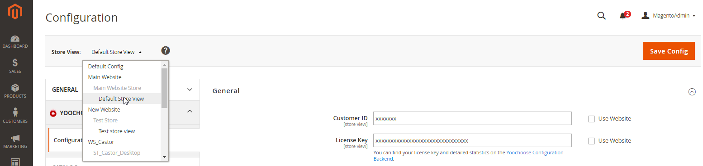
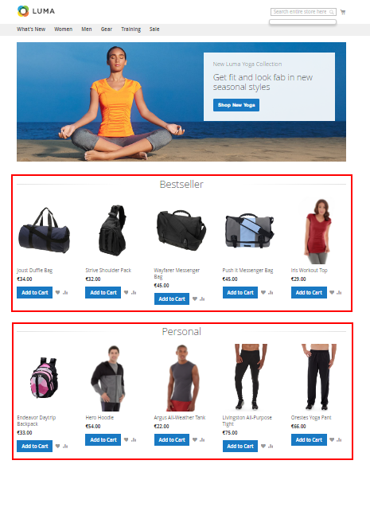
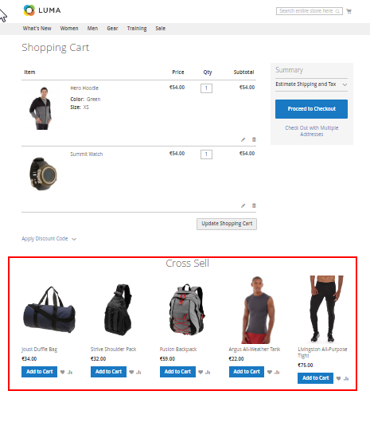
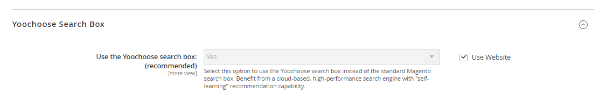
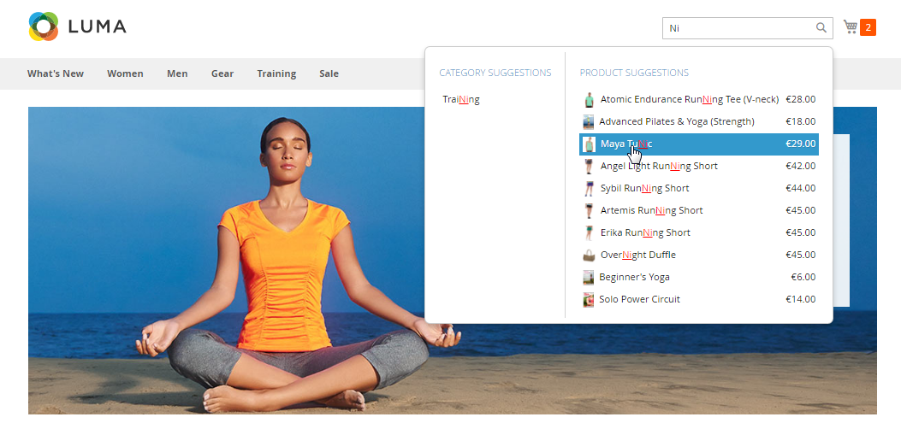

# Magento2

## Introduction

If you are not familiar with the usage of recommendations, read the [introduction](../personalization/user_guide/introduction.md) and [use cases](../personalization/user_guide/use_cases.md) from the User Guide.

## Installation

First install the Yoochoose Recommendation Engine Extension.
It can be done through the [Magento Marketplace](https://marketplace.magento.com/) (search for *yoochoose*).
The extension is free to download and install.
The service itself is based on performance of the recommendations.
See [Performance Pricing section](https://www.yoochoose.com/en/pricing/) for details.

In order to install the extension on your local Magento2 installation, your purchases need to be synced via the [Component Manager](https://devdocs.magento.com/guides/v2.1/comp-mgr/module-man/compman-start.html)

## Account registration

Before enabling the recommendation engine for your web shop, register a new *Magento Connect* account on the [Yoochoose web page](https://www.yoochoose.com/en/pricing/).

Select the **Magento Module** in the option box (Magento2 and Magento use the same [registration link](https://admin.yoochoose.net/login.html?product=magento_Direct&lang=en_US#login)).

An account contains a default configuration scenario for a standard web shop.
If you are configuring a highly visited web shop (over a million page requests per month), you should ask Yoochoose GmbH for additional consultation and phone support.

Once the registration is finished, you will get a customer ID and the license key for the recommendation extension.

## Activation of the YOOCHOOSE extension

The Extension configuration/enabling is located in the Magento Admin Panel under **Stores** > **Configuration** > **YOOCHOOSE**.

In the admin interface of Magento 2 enter your customer ID and license key.

## Firewall configuration

The Magento2 Recommendation module needs connection to the Yoochoose configuration server: `admin.yoochoose.net`

Both HTTP (port 80) and HTTPS (port 443) ports must be open for outbound TCP connections.
You cannot build the firewall rule based on the IP addresses.
The Yoochoose infrastructure is located in the AWS cloud and the IP addresses can change.

## Available Recommendation Blocks

The Yoochoose extension will automatically launch after the installation is completed. After that the extension will track page visitors and personalize shopping experience for them.

The following options are available:

- **Bestsellers** are shown on the home page for all visitors and on the main category pages. 
- **Personal recommendations** are shown to registered customers or to anonymous visitors with a persistent or long living session. It analyses the purchasing and click history of the visitors and suggests new products.

- Category **Related** is created with products that customers usually buy together with the current product (e.g. butter and bread).
- **Upselling** recommendations (on the product details block) show products that customers buy instead of the current product (for example printer *X* instead of *Z*).

- **Cross sell** products are similar to the related products, but they are calculated based on the customer's shopping cart.

## Personalized Search integration

We also offer a Personalized Search Service which can search for vendors, category and products.
It can be activated in the Magento2 back end in the Extension configuration.

An example of the search results can be seen here:

## Development and maintenance

Further development of the extension is welcome.
Visit our [bitbucket repository](https://bitbucket.org/yoochoose/).
Don't hesitate to contact us for improvements, bug fixes or anything else related to the extension.
