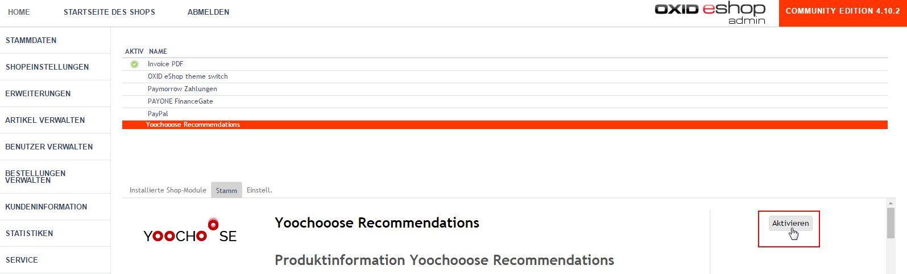
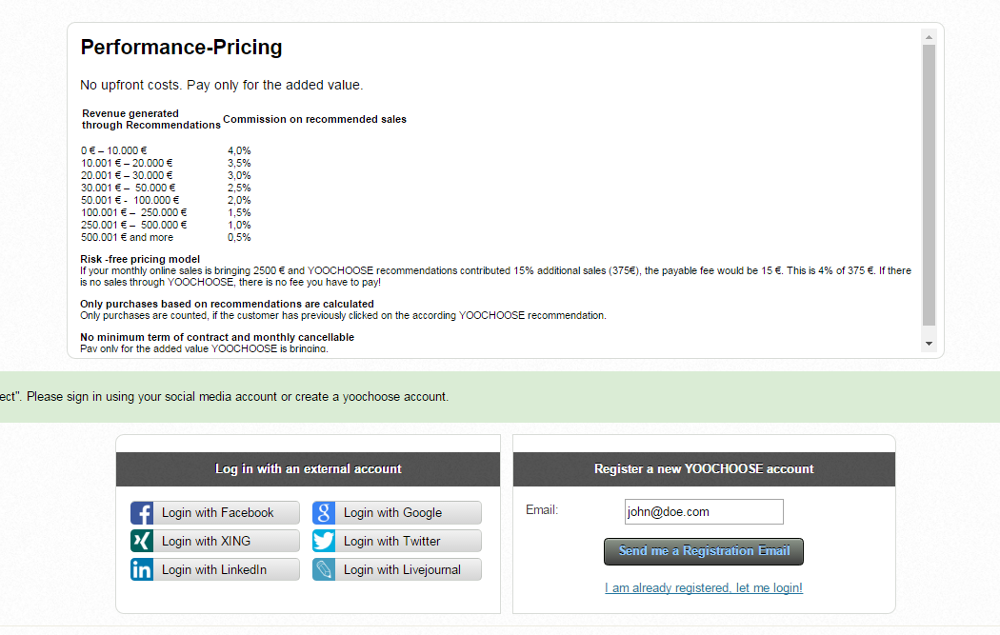
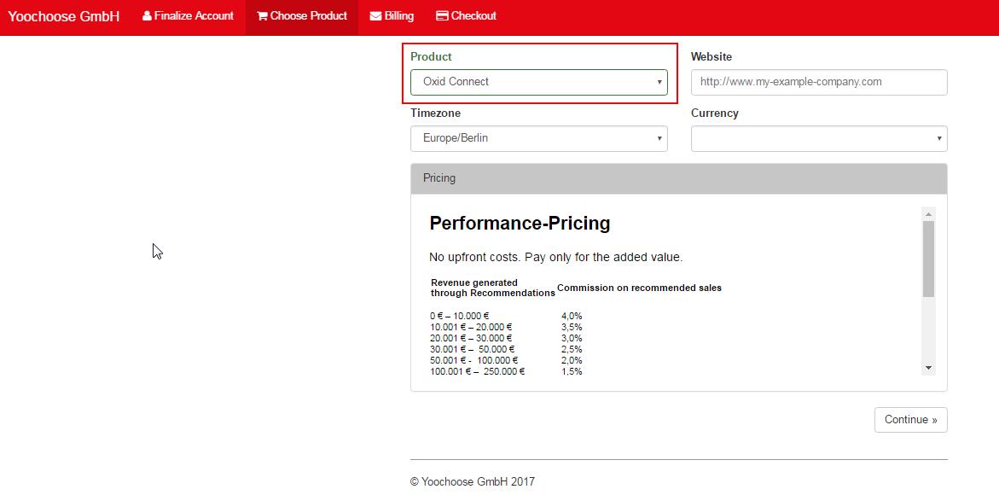
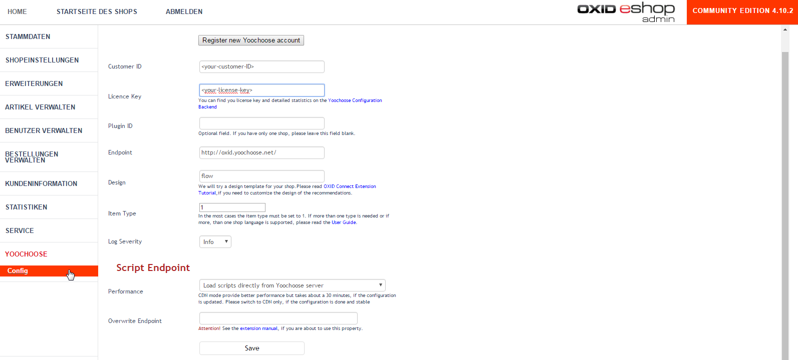
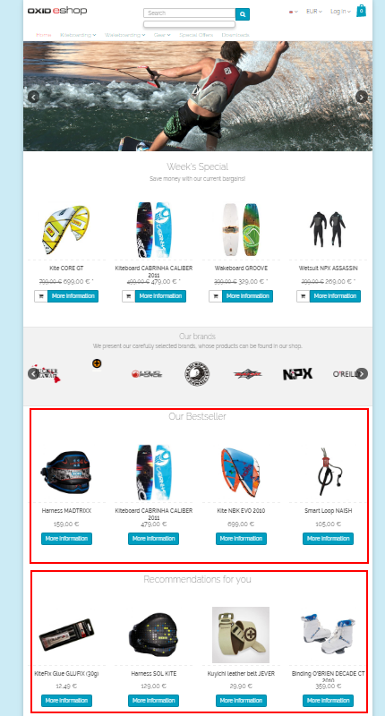
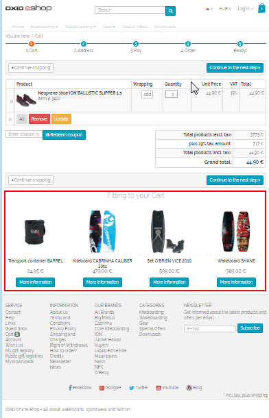

# OXID

## Introduction

Your customers expect high-quality recommendations. They want to be supported in their purchasing decision and selection process. By using Yoochoose recommendations you increase the usability and the level of professionalism of your online shop. The recommendations present products to the customer they had not expected to find - which distinguishes them from search.

If you are not familiar with the usage of recommendations, please read at least the [first](../personalization/user_guide/introduction.md) [two](../personalization/user_guide/use_cases.md) pages of the User Guide. Otherwise you can proceed with the following steps.

## Requirements

OXID eShop version:

- CE &gt; 4.7.x
- EE, PE 5.x

## Network and Firewall Configuration

The OXID Recommendation module needs connection to the following endpoints:

- `admin.yoochoose.net`
- `reco.yoochoose.net`
- `event.yoochoose.net`

Both http (port 80) and https (port 443) ports must be open for outbound TCP connections. You cannot build the firewall rule based on IP. The Yoochoose infrastructure is located in the AWS cloud and IP addresses can be changed.

The OXID recommendation module loads recommendations using JavaScript after the shop page is already rendered. If the Yoochoose infrastructure is not available, it won't affect the loading time of OXID webpages.

## Installation

Download the Yoochoose module package from the Yoochoose Bitbucket repository under <https://bitbucket.org/yoochoose/tracking>. Copy the content of the folder `src/plugins/oxid` into the modules folder of your OXID installation.

The structure should look like this:

    ./modules/yoochoose/yoochoose/..

Don't worry if you see a `yoochoose/yoochoose/` in the directory tree. This is correct.

If you have a subfolder `Mediaopt` inside the `modules` directory, please remove it. It is an old version of the plugin.

## Activation

In the OXID administration back end go to

`/Extentions/Modules/Yoochoose Recommendations`

and click "Activate".

After that, refresh the browser window (or hit F5). A new menu element `/Yoochoose` must appear under the menu Service.

## Registration

In the OXID administration back end go to `/Yoochoose/Config `and click "Register new Yoochoose account".

Register an account 

Ensure that Oxid Connect is selected

After a successful registration process you will receive a customer ID and a license key by email. Add this information into the corresponding fields in the module configuration page `/Yoochoose/Config`

Default recommendation settings are preconfigured and you can start tracking user data.

The customer ID and the license key can also be obtained later in the YOOCHOOSE back end under <https://admin.yoochoose.net>. Login is the email address you used in the registration process.

Please be patient. After the plugin is activated it takes about a day until the first recommendations are available. The recommendation engine needs to collect statistical information before high quality recommendations can be provided. If enough tracking data is available, they will be rendered in your shop.

## Structure and Functionality

The recommendation module is configured with default recommendation boxes throughout the OXID shop:

- Landing Page "Bestsellers" with most popular products
- Landing Page "Recommendations for You" recommendation based on your shopping taste
- Category Page "Bestsellers" with the most popular products in the current category
- Product Detail Page "What other customers bought" with recommendations that others bought alongside the currently displayed product
- Product Detail Page "You may be interested in" with recommendations of alternative products that were often viewed together with the current one
- Shopping Cart recommendations with products that fit your shopping basket

## Disabling Embedded Recommendation

Several database-intensive cross selling boxes are available in OXID out of the box which should be deactivated. It can be done in the OXID admin back end in `/Master Settings/Core Settings/Performance/Enhanced Performance Settings`

