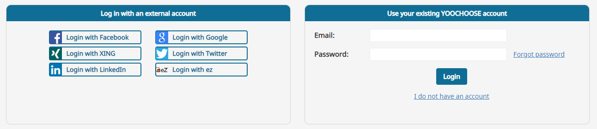
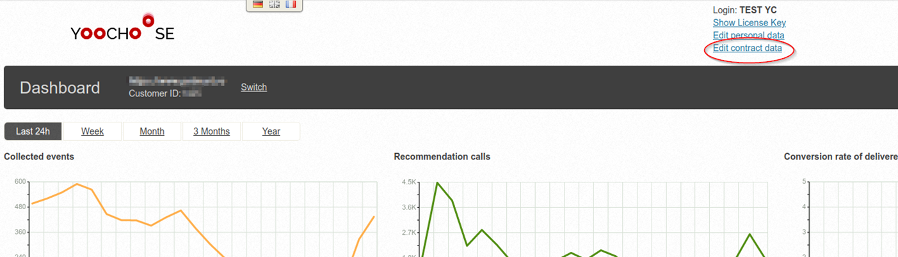
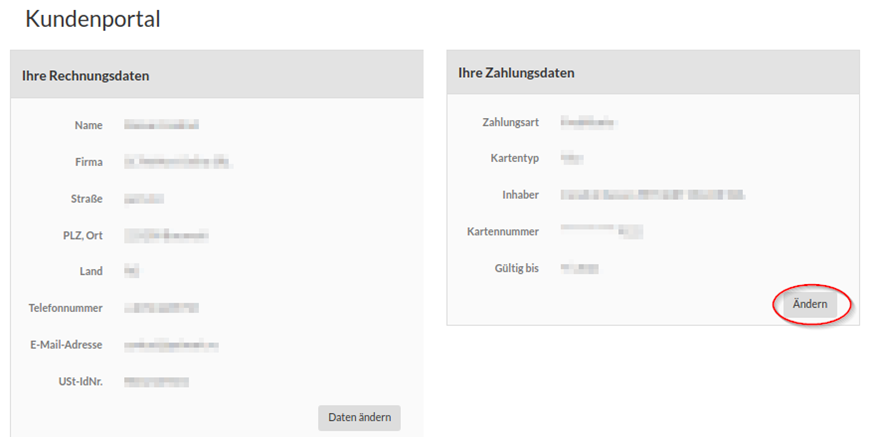
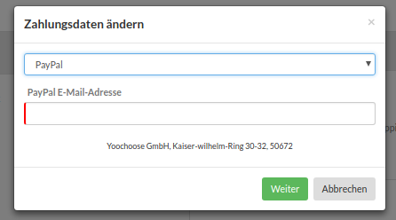

# Renewing PayPal contract

PayPal has a built-in security mechanism that expires a customer contract (subscription) after one year.

After this happens, you need to add payment information again to renew the contract.

The steps are the same as during registration:

Step 1: Go to https://admin.yoochoose.net and log in with your email and password.

Step 2: Click "Edit contract data" at the top. (If you have a German account, the link will say "Vertragsdaten ändern").

Step 3: A new window opens with the billwerk partner site. Billwerk is responsible for handling Personalization payments.

In the billwerk customer portal, in the section "Ihre Zahlungsdaten" (Payment method), click "Ändern" (Change) to select a payment method.

Step 4: Select "PayPal" and enter your PayPal email address. Click "Weiter" (Next).

You will be redirected to the PayPal website where you can renew your PayPal contract/payment authorization.

