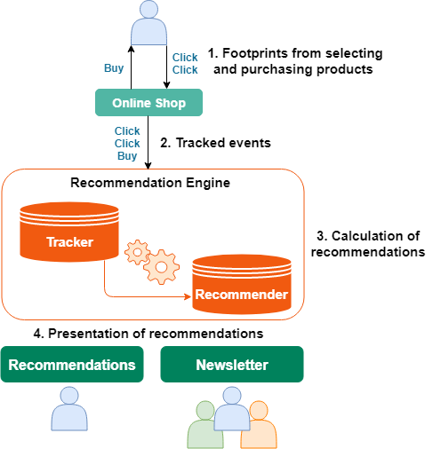

# About Personalization

eZ Personalization is a service for offering personalized recommendations to visitors to your website. It can be used to serve targeted content to users based on their preferences and behavior.

eZ Personalization can be used both by publishers (to serve personalized content and track its consumption), and in e-commerce (to recommend other products to purchase).

## Benefits

Recommending items helps users navigate and make choices when faced with a mass of content. Recommendations show relevant information to users who are browsing a website, improve their online experience and increase the chance to keep them on your site.

## Recommendation types

There are three types of recommendations:

- Online recommendations
- Newsletter recommendations
- Search recommendations

### Online recommendations

The most common type are **online recommendations**. They are well-known in form of the "What other users bought" and the "Also interesting for you" boxes on e-commerce websites such as Amazon. These are pure online recommendations that are displayed within a given context. This could either be a detail page with a product or the personalized landing page, where recommendations are based on a user's personal history. Online recommendations are used to a similar effect in the publishing sector. While reading you often find "Related content" boxes on the site which are mostly based on the reading behavior of the visitors or the popularity of current content.

In order to provide online recommendations a recommendation engine must at least:

- track user actions through a web browser or a mobile app
- store the user actions
- use the data to generate recommendations
- provide recommendations on a customer's website

When visiting a website, users usually consume content and - if on an e-commerce site - they may buy products. Clicking, buying and consuming content are examples of actions that are collected in a recommender engine and later processed to generate recommendations. After collecting sufficient user activity, the recommender engine can be "asked" for recommendations in the current context. Usually the context is the current content or product where recommendations should be presented for. But it could also be the personal history of a user, meaning the content they were reading or the products they have bought.

### Newsletter recommendations

True **personalized newsletters** go beyond simply using the name and the gender of the recipient, which is not really what we expect as personalization. What we expect and provide is personalized content in newsletters which is tailored to the taste and interests of the recipient. Prerequisite is that there's recipient's history on the website which is "sending" the newsletters.

Recommendations in newsletters are typically embedded during the sending process and are therefore statically integrated but with different content for each newsletter (off-line) recipient. It is also possible to add them while opening the email and using the user's most recent history to generate them.

### Search recommendations

**Personalizing search results** is a possibility to rerank search hits not only by the usual matching score of the underlying engine. It also takes into account the user's affinity to certain content that they have visited before and reorders the results before showing them to the user. By reordering search result and tailoring it to the user, we "recommend" better search results than the ones coming purely from the search engine.
