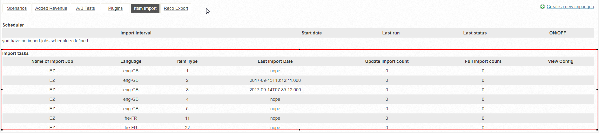

# eZ Recommendation Bundle

!!! note "GitHub - Documentation"

    This bundle itself is documented and maintained in the GitHub Repository under https://github.com/ezsystems/EzSystemsRecommendationBundle.

    Background information is listed below.

## Introduction

The [EzSystemsRecommendationBundle](https://github.com/ezsystems/EzSystemsRecommendationBundle) is a completely client-based recommendation extension that can be integrated into eZ. It includes a tracking mechanism that sends usage data to the recommender tracking servers to calculate recommendations.

It can be used for:

- displaying personalized recommendations that meet interests based on a users's behavior
- providing recommendations based on the current context of a user (the content itself)
- push defined content, e.g. paid and non-paid
- cross-recommend content (e.g. users who read this article also watched this video)
- provide information about the current content, e.g. how many users are currently watching the content that recommendations are requested for
- provide search suggestions and matching content

## Requirements

In order to enable the extension, some preparation is needed which covers the following

1. Install the bundle: https://github.com/ezsystems/EzSystemsRecommendationBundle
1. Allow access to the eZ instance's API (see [Whitelisting](#whitelisting-to-access-the-ez-api))
1. Define what should be tracked and enable the tracking: https://github.com/ezsystems/EzSystemsRecommendationBundle#tracking-of-users-activity
1. Define the content to be imported
1. Style and enable the rendering of recommendations: https://github.com/ezsystems/EzSystemsRecommendationBundle#displaying

That's it.

### Whitelisting to access the eZ API

YC needs to access the API of an eZ installation in order to sync customer data. If a whitelist of IPs is needed, use the following ones

- 46.51.203.199
- 46.51.199.127
- 87.139.123.237
- 92.50.96.242
- 46.137.101.208
- 54.229.102.177
- 79.125.126.82
- 54.93.91.48
- 54.93.179.211
- 52.215.22.234
- 54.77.201.13

### Content types to be tracked

Define the list of content types, their identifier and the language that should be tracked and recommended. You can only recommend what you track.

| content type | identifier | language |
|--------------|------------|----------|
| 16           | article    | eng-GB   |
| 72           | blog       | eng-GB   |
| ...          |            |          |

Send a complete list to <support@yoochoose.com> or contact YOOCHOOSE employees directly.

### Import of customer content

#### Testing the bundle controller

You can verify the content controller of the bundle by calling the local API. To check if the **content** interface is working as expected, please check this URI.

**`GET http(s)://{endpoint}/api/ezp/v2/ez_recommendation/v1/content/{contentId}`**

`Accept    application/vnd.ez.api.Content+json`

`Authorization    Basic xxxxxxxx`

To check if the **contenttype** interface is working and delivers the correct content fields:

**`GET http(s)://{endpoint}/api/ezp/v2/ez_recommendation/v1/contenttypes/16`**

`Accept    application/vnd.ez.api.Content+json`

`Authorization    Basic xxxxxxxx`

By default the following fields of eZ Content are imported:

- uri
- identifier
- language
- publishedDate
- categorypath (content object structure that leads from the root content to the current)

All additional data that should be delivered from the Recommendation Service to be rendered on the client-side must be configured. For examples see the table below

| content type | identifier | language | additional fields to be imported |
|--------------|------------|----------|----------------------------------|
| 16           | article    | eng-GB   | short\_description, title, image |
| 72           | blog       | eng-GB   | abstract, title                  |
| ...          |            |          |                                  |

In case of an image, only the hyperlink is stored in the Recommender.

Send this list to YC and we will take care of the setup process.

#### Initial full import

It is required to make an initial import of customer data to fill the Recommender System with the data that should be delivered with a recommendation response. You can start it with

**`GET http(s)://{endpoint}/api/ezp/v2/ez_recommendation/v1/contenttypes/{your_content_type}/export?hidden=1&webHook=https%3A%2F%2Fadmin.yoochoose.net%2Fapi%2F{your_mandator_id}%2Fitems&transaction=20170808101010999`**

The local eZ system:

1. creates some .json formatted export files,
1. notifies the endpoint admin.yoochoose.net 
1. which then later on fetches the files to import the content.

After finishing the import you should see something similar to this in the admin backend under `https://admin.yoochoose.net`.



Please contact support@yoochoose.com if there are any problems.

#### Incremental import

In order not to make a full content sync every day the eZ backend sends a notification automatically to the Recommender System when content was created, deleted or updated. With this mechanism the content of the Recommender Engine stays in sync with the customer content.

Example of a POSTed .json body:

``` json
{
    "transaction" : null, //optional
    "events" : [
        {
            "action" : "UPDATE",
            "uri": "/api/ezp/v2/content/objects/123456",
            "lang": "eng-GB"
        }
    ]
}
```

The recommender will then later fetch this content via the above mentioned content API of the customer system and update the local data which can be returned in a recommendation response.

### Fetching Recommendations

Fetching recommendations is implemented in the bundle and can be enabled in templates by following the instructions under https://github.com/ezsystems/EzSystemsRecommendationBundle#displaying

Recommendation responses contain all requested data which is available, i.e. successfully imported. For example a request:

**`GET [http://reco.yoochoose.net/api/&lt;mandator&gt;/&lt;user&gt;/blog.json?...&attribute=uri&attribute=title&attribute=image&attribute=short\_description]()`**

would deliver the following response

**Recommendation response**

``` json
{
  "contextItems": [
    {
      "itemId": 81,
      "itemType": 2,
      "sources": [
        "REQUEST"
      ],
      "viewers": 0
    }
  ],
  "recommendationItems": [
    {
      "itemId": 80,
      "itemType": 2,
      "relevance": 126,
      "links": {
        "clickRecommended": "//event.yoochoose.net/api/723/clickrecommended/someuser/2/80?scenario=article&modelid=9105",
        "rendered": "//event.yoochoose.net/api/723/rendered/someuser/2/80?scenario=article&modelid=9105"
      },
      "attributes": [
        {
          "key": "title",
          "values": [
            "Jamaican cuisine"
          ]
        },
        {
          "key": "categorypath",
          "values": []
        },
        {
          "key": "price",
          "values": []
        }
      ]
    },
    {
      "itemId": 79,
      "itemType": 2,
      "relevance": 125,
      "links": {
        "clickRecommended": "//event.yoochoose.net/api/723/clickrecommended/someuser/2/79?scenario=article&modelid=9105",
        "rendered": "//event.yoochoose.net/api/723/rendered/someuser/2/79?scenario=article&modelid=9105"
      },
      "attributes": [
        {
          "key": "title",
          "values": [
            "Israeli Cuisine"
          ]
        },
        {
          "key": "categorypath",
          "values": []
        },
        {
          "key": "price",
          "values": []
        }
      ]
    },
    {
      "itemId": 62,
      "itemType": 2,
      "relevance": 124,
      "links": {
        "clickRecommended": "//event.yoochoose.net/api/723/clickrecommended/someuser/2/62?scenario=article&modelid=9105",
        "rendered": "//event.yoochoose.net/api/723/rendered/someuser/2/62?scenario=article&modelid=9105"
      },
      "attributes": [
        {
          "key": "title",
          "values": [
            "Mexican Cuisine"
          ]
        },
        {
          "key": "categorypath",
          "values": []
        },
        {
          "key": "price",
          "values": []
        }
      ]
    }, ...

  ]
}
```

This response can be interpreted and rendered by the RecommendationBundle's own HandleBar templates.
