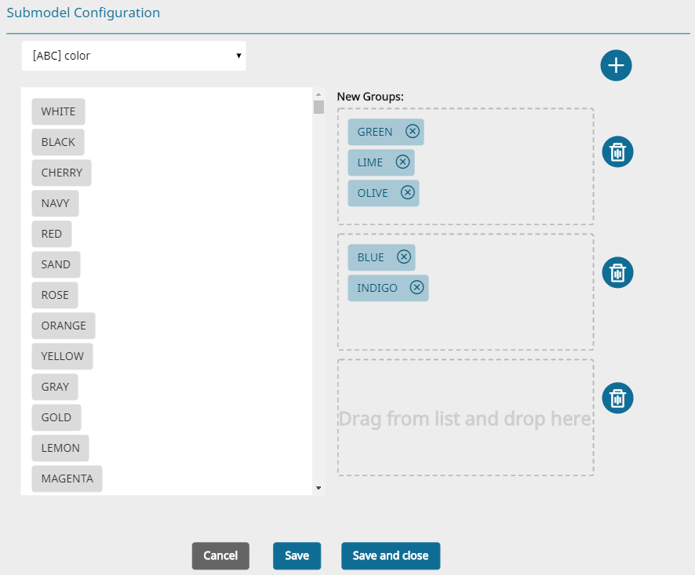
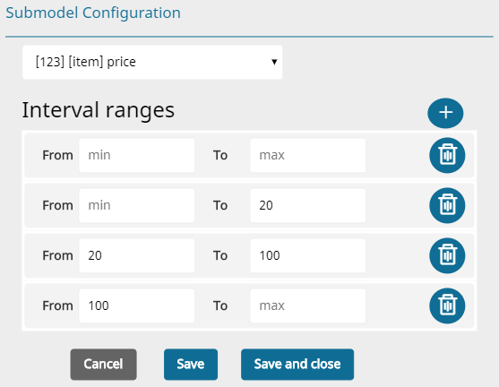

# 6. Recommendation Models

Chapter [2. Use Cases](use_cases) describes where recommendations can be used in real-world situations. They are based on algorithms and the calculated result of an algorithm is called a model. The models work in the background and are updated regularly to provide recommendations. There are several types of models available:

### Models available for both basic and advanced edition

#### Popularity

Classic popularity recommendation. The model can be customized using time-dependent weights (recent events are more important) and category based filtering (bestsellers in selected category and/or subcategories).

#### Also clicked/purchased

This type of recommendation is often called "Collaborative Filtering based on user data" and is a proven approach to calculating recommendations. It recommends products which are usually clicked or purchased together. It is very simple to configure, needs no maintenance and it is a very powerful model.

#### Ultimately bought

This model combines click and buy events. In human readable form it could be something like "Users who looked for that kind of product finally bought this". It therefore provides a "matching factor" of searching and buying. This model suggests alternative products which customers bought after they clicked on the selected product. In contrast to the "also-bought" model it recommends products that are related but not purchased together. This model is the best choice to suggest alternative products for their search. For example, a user searches for a book which explains how to cut trees. If they finds a book and on the book page this exact same book is being recommended, it means that several users interested in cutting trees bought this book (and not others), which hints that this book is the very best choice.

#### History based

Pseudo recommendation model to show the user products from his own history. Like "you have just watched" box.

### Additional models are available for advanced editions

#### Frequently bought together / Bundle recommendations

Products that were bought in this combination for at least n times can be treated as bundles and recommended as a "package". Based on the product which is currently shown, this model can recommend other products that fit exactly the one the user is currently looking at. An example could be:

A user wants to buy a smartphone and browses on the detail page of smartphone X. Additionally to the "Also Clicked" recommendations, the Recommender Engine would recommend the bundle *Smartphone X + Smartphone X Cover + Headphones* as they were  bought together in exactly this combination for at least five times.

It is not guaranteed that there's a bundle available for every product. Therefore a rendering logic should display a box of bundle recommendations only if they are available, otherwise the box can be left out. Remember that the currently displayed product is always included in the bundle.

#### Content Based (by attributes)

The content based algorithm calculates the similarity scores among products based on given attributes. This algorithm depends on expert knowledge because you should be able to define the most important attributes of the product catalog. An example could be the price, the producer or the location of a product. In the news domain, this may be the story location the article is talking about, the author or the category. The distinct attributes should be limited in their range (a nominal set) because it does not make sense to build similarities based on attributes that are different for each product (e.g. a timestamp or EAN-Code). There is also a need to assign weights to these attributes since they are used to compute the importance weight of each attribute for the similarity.

#### Content Based (by semantic full text analysis)

This model provides similarities based on free text analysis and indexing. This is a very powerful model publishers can use to get similar articles based on their content without the need of manual maintenance of related articles by e.g. editors. The full text analysis algorithm uses a search engine in the background.

#### Similar Rated

The similar rated algorithm provides recommendations based on user preferences. It predicts similar articles which the user will probably like and that will suit their interests. Recommendations for articles similar to their dislikes are suppressed.

#### Best Rated

The best rated model provides recommendations based on algorithms that include the ranking values and the amount of distinct ratings. It is best suited for landing or category pages.

#### Random

Semi-random products from the most recent ones. It allows injecting new products to the recommendation while the history based models are not yet able to recommend products based on the statistics. It is a really simplified and unsophisticated alternative if no other information is available to calculate and provide recommendations.

This model is not built based on the history footprints but based on the imported product catalog.

#### Editor based

Products that are manually selected by a human. A customer can replace an automatically generated recommendation with a predefined list. It is best suited when the store administrator wants to add special offers or sell stock remains. It could also be called "static recommendations".

#### Blacklist

Products on this list will never be recommended in any scenario. Usually test products or products that are used for system monitoring are placed on this list. Be careful to use this model in any scenario config, it works globally!

## Advanced Model Configuration

Most of the models provide additional configuration parameters for customization. Here is an example:

Open a Scenario configuration in the Dashboard

and enter the model configuration of a Collaborative-Filtering model

or an Editor-Based model

The parameters supported by the different types of models are described in the table below. Some models support submodels, see chapter [Submodels](#submodels) for more information. Additional differentiation criteria is the supported [context](Definitions_32869233.html#Definitions-Context). If a model requires context it can only be linked to scenarios that provide the necessary context.

|Model type|Available parameters|Submodel support|Context|
|---|---|---|---|
|Popularity|Relevant event history defines the time period for which the statistics must be analyzed. Dependent on the product type it can be between several months and several hours.Fast event aging can be used to weight newer events higher than older events.|yes submodels based on category are enabled by default|not needed|
|Also clicked/bought / Ultimately bought|Both also clicked and ultimately bought models allow to define the relevant event history.|yes, manual|required (either context items or user data)|
|Random|This model requires the maximum age for the items that should be recommended by this model.|no|not supported|
|History based|The type of the history (click-history or buy-history) must be specified|no|required (user data)|
|Editor based|The list of recommendations must be created manually by the editor.|no|not supported|
|Blacklist|The list of items that should be excluded from the recommendations must be created manually by the editor.|no|not supported|

Do not confuse event history age with item age. History age is the age of the user's footprint (for example "they clicked on the product A two weeks ago"). Item age is the time over which the item is available in the shop - so to say "how new is the item". The history is filled automatically over event tracking (see [4. Event Types](event_types.md)). The item catalog must be filled separately over an item import.

## Submodels

Statistics-based recommendations often have the disadvantage of providing recommendations limited to the "most"-popular, "most"-suitable to you or "most"-similar products. Often it is needed to extend the set of available recommendations by defining a subset of most-"something" items based on some external criteria. For example:

- most popular products for the predefined age (searching for a toy)
- also bought products with the same color (for clothes)
- also bought products with a predefined price (searching for a birthday present)

Submodels provide the possibility to group all the products based on an attribute. Recommendations can then be requested especially for the selected group.

#### Nominal Attributes

If the possible values of some attribute are a limited set of values, we talk about a nominal attribute submodel, for example the number of possible colors. The set of possible values is usually limited and every product has a single color attached to it.

Submodels must be manually configured. Therefore it works only if the number of possible values is relatively small and there is a large group of products for every value. Good examples would be "color" for clothing store, "genre" for a book store or "city district" for a newspaper. Bad examples would be ~~street name~~ (there are too many of them), ~~book author~~ (there are too many of them as well) or EAN-Code (they are unique and therefore hard to group).

Coming back to the color example. We are configuring submodels for a clothing store and want to get recommendations for some color (it can be a predefined color or a color of the context item). Every manufacturer has its own color classification. Similar colors can be grouped together as shown in the picture below:

The configuration is done using the property dialog of the recommendation model.

After the submodel is configured and built (happens automatically during the nightly build process) there are several cases for recommendations. Based on the example above the following are possible:

|Attribute example in the recommendation request|Result|
|---|---|
|color=lime|Value "lime" is found in the green-ish group (Group 1). There are products in this group. If a model has some of them, they will be recommended.|
|color=sand|Value "indigo" is found in the blue-ish group. There are no products in the group. Nothing will be recommended by this model. The fallback model (if configured) will be used.|
|color=white|Value "white" was not found in any of groups. The main model will be used. Items from all submodel groups can appear in the result (as if the submodels were not configured at all.).|
|no attribute specified|The main (full) model will be used, means the request is handled as if submodels were not configured at all. Products from the whole shop could appear in the recommendation list.|

#### Numeric Attributes

Very similar configuration can be done by using a numeric attribute.
Similar to the nominal submodels, the configuration is about the definition of subgroups. 
It is done by selecting limits for every group.

There are two values used for setting the limits — `from` and `to`.

The logic behind it is as follows:

- The `from` value indicates the beginning of the range of the subgroup and belongs to it.
- The `to` value indicates only the range end and does not belong to the subgroup.
- The **only exception** is the last of the defined subgroups.
In its case, the `to` value indicates the range end and also belongs to it. 

!!! note

    1. Both numeric and nominal attribute can have multiple values. Such a product will be placed in multiple submodel groups.
    1. Submodel results are not available immediately after the submodel is configured. In contrary to category filters and general filters, submodels must be (re)built during the nightly building process. The results are usually available on the next day.
    1. It is possible to specify a single or multiple attributes with multiple values for requesting recommendations. In this case the recommendation will be fetched from all the submodels and merged based on the weight (aka relevance). If one of the submodels delivers recommendations with better relevance (which is very often the case) it is possible that the results of other models will be removed from the list.

!!! tip

    Once configured, submodels are enabled for the model globally. All the scenarios which use this model will be aware of it. If it is not intended to activate the recommendation grouping in some cases, do not provide the attribute parameter in the request. The submodel is not used then.

    See [Recommendation API](../developer_guide/recommendation_api.md) in the developer documentation for more information.
